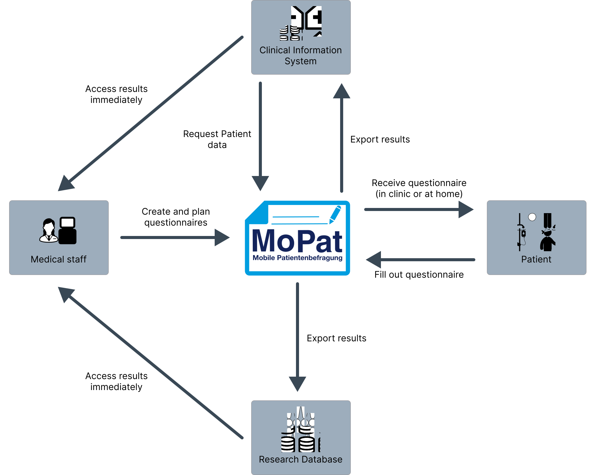

<!-- TEST_REPORT_START -->
<!-- TEST_REPORT_END -->

# Mobile Patient Survey (MoPat)
MoPat is a web-based platform designed to transform conventional paper-based questionnaires into a digital format. The application is universally usable across a range of devices, including desktop computers, tablets, and smartphones. Thanks to its full compatibility with all major operating systems such as Windows, MacOS, Linux, iOS, and Android via the web browser, MoPat offers users the flexibility to access the questionnaire service on any device with network access. By automatically exporting the questionnaire results into different systems, MoPat can integrate with other systems. <br />
**DISCLAIMER: MoPat is not a certified Medical Device Software according to the Medical Device Regulation. Hence, the calculation of scores can only be used for research purposes.** 

Currently MoPat supports the automatic export to the following data formats or systems: 

- [CDISC ODM v1.3.2](https://www.cdisc.org/standards/data-exchange/odm) 
- [HL7 FHIR R3](https://hl7.org/fhir/) (R4B coming soon) 
- [HL7 v2.3](https://www.hl7.org/implement/standards/product_brief.cfm?product_id=185) 
- [REDCap v14+](https://www.project-redcap.org/) 




## Documentation and Wiki
We have a dedicated [GitHub Wiki](https://github.com/imi-ms/MoPat/wiki) that describes MoPats functions in detail.

## Setup development environment
Steps to install the project locally:

```bash
# Clone the repository to your local machine
git clone https://github.com/imi-ms/MoPat.git

# Go into the project directory
cd mopat

# Fetch dependencies and build the application
mvn clean install
```
This will also create the deployable WAR file under `target/MoPat.war`

## Installation

### Docker 
If you want to run MoPat via Docker, you can use [docker-compose](https://github.com/docker/compose).

A Dockerfile to build and run MoPat, as well as a docker-compose configuration is included in the project.
The setup is runnable without needing to perform any additional changes to the project: 

```bash
docker-compose up
```
This will create all necessary docker containers as well as the network, so they are able to communicate.<br/>
Docker is configured to automatically mount local directories into the container to be able to persist database, exports and uploads across different installations. <br/>

Initially the following paths are mounted: 
- `<MoPat directory>/data/db`
- `<MoPat directory>/data/images`
- `<MoPat directory>/data/upload`
- `<MoPat directory>/data/export/FHIR`
- `<MoPat directory>/data/export/HL7`
- `<MoPat directory>/data/export/ODM`

Make sure these directories exist, to ensure that the data will be saved outside of the container. 
It is possible, that you will not be able to view the contents of these directories, as docker will determine the rights for the files.
Under Linux, you can adjust these rights by running the following command:
```bash
sudo chmod -R 775 ./data
```

While the application is runnable without any additional settings, it is highly advised to adjust the `.env` file in the root directory of the project to use secure settings.


### Manual Installation
To install the application manually, follow these steps carefully:

#### Prerequisites

Before you begin, ensure you have met the following requirements:

1. MySQL Database 
- You need a local MySQL database running on your machine. Ensure you have MySQL installed and running before you proceed. We recommend to use MariaDB to ensure that everything is working correctly.

2. Database User
- Create a user named `mopat` in your MySQL database. It is recommended to set a secure password for this user, even if you only test the application locally.

3. Configuration File
- You can override the standard MoPat configuration by creating a file named `config.properties` under `/etc/mopat/`. This will adjust the application during runtime to use your local settings. To override the database URLs and authentication settings, use the following properties:
```conf
de.imi.mopat.datasource.user=
de.imi.mopat.datasource.password=
de.imi.mopat.datasource.mopatDataSource.jdbc-url=jdbc:mysql://localhost:3306/moPat?autoReconnect=true&useUnicode=true&useEncoding=true&characterEncoding=UTF-8
de.imi.mopat.datasource.mopat_userDataSource.jdbc-url=jdbc:mysql://localhost:3306/moPat_user?autoReconnect=true&useUnicode=true&useEncoding=true&characterEncoding=UTF-8
de.imi.mopat.datasource.mopat_auditDataSource.jdbc-url=jdbc:mysql://localhost:3306/moPat_audit?autoReconnect=true&useUnicode=true&useEncoding=true&characterEncoding=UTF-8
```
- It is also possible to change the path of the properties file. However this is only possible by modifying the `mopat.properties` in the repository and building the application yourself.
4. Database Initialization
- We provide scripts to ease the initialization of the database. To use them, navigate to the db folder in the project directory.<br/>
Run the script installationInit to set up your database schema:
```bash
mysql -u root -p < installationInit.sql
``` 
Run the script installationInitTest to populate a test database with initial test data. Unit tests rely on this database:

```bash
mysql -u root -p < installationInitTest.sql
```

Since `<` is a reserverd symbol for powershell, if you want to run the scripts on Windows you could instead use the following command:
```powershell
Get-Content path/to/installationInit.sql | mysql -u root -p
```

5. Java
- Ensure you have a suitable Java Runtime Environment installed that can run Java 17 applications.

6. Tomcat
- In order to run the application as a service on a server the use of Tomcat is highly recommended. At least Tomcat 10 is required to run MoPat.


#### Start MoPat
If you are installing MoPat on a server, it is recommended to run Tomcat as a service. This ensures that Tomcat automatically starts up whenever the server is rebooted and runs in the background.
On Linux, you can use system management tools like systemd or init to configure Tomcat as a service.

Alternatively, if you are not running Tomcat as a service, you can start it manually using the startup.sh script (on Linux/Unix) or startup.bat script (on Windows) located in the bin directory of your Tomcat installation folder.

Build the WAR (Web Application Archive) file from the MoPat source code or obtain a [pre-built WAR](https://github.com/imi-ms/MoPat/releases) file from the repository.
MoPat uses logback to send out e-mails, when an error occurred. To make sure this works, please adjust `src/main/resources/mopat.properties`:
```conf
de.imi.mopat.logback.email.host=
de.imi.mopat.logback.email.from=
de.imi.mopat.logback.email.to=
```
Then, copy the MoPat WAR file into the webapps directory of your Tomcat installation. Tomcat will automatically deploy the web application during its startup or on-the-fly if it is already running.

The application needs read- and write privileges to store application data. If you deploy MoPat on a server with Tomcat, you may have to explicitly allow tomcat to write to these locations. You can do so by creating a file `read-write-path.conf` under `/etc/systemd/system/tomcat10.service.d`.
This file should then contain the necessary location paths:
```text
[Service]
ReadWritePaths=/var/log/
ReadWritePaths=/var/lib/tomcat10/exports/
ReadWritePaths=/var/lib/tomcat10/upload/
ReadWritePaths=/var/lib/tomcat10/images/
```

#### Accessing MoPat 
Once deployed, you can access MoPat by navigating to the Tomcat URL where the WAR was deployed. Typically, the URL format will be `http://[hostname]:[port]/[path]`, where `[hostname]` is the address of your server or localhost for local setups, `[port]` is the port on which Tomcat is running (default is usually 8080) and `[path]` is the context path (usually derived from the file name). In order to deploy the application under the root path, the `MoPat.war` file should be renamed to `ROOT.war` before copying it to the tomcat webapps directory. 

## Initial Setup
After successfully deploying MoPat, you have to configure several aspects of the application.
Initially an Admin user will be created with the credentials "admin"/"admin123". Please create a secure admin account with the invitation feature of MoPat and deactivate the initial admin user. Alternatively you can directly delete the account from the database.

After that, open the configuration page and configure MoPat to fit to your needs. There are many aspects that can be configured, so it is advised to read the [Wiki](https://github.com/imi-ms/MoPat/wiki/MoPat-Admin-instructions#configuration) for more info on the different configuration possibilities.
**Make sure to at least configure the file paths for MoPat, as the application will not work correctly otherwise.**

## Troubleshooting
MoPat makes use of Logback and SLF4J logging. The logging mechanism is configured to create separate logging files for info, warning, error and debug information under `<TOMCAT_ROOT>/logs/`. 
When you encounter any errors, please look into the logs. If you think you encountered a bug, you can create a ticket and attach the error and debug logs. 

**Beware, that in a productive setting, sensitive information could be stored in these files.**

## Install MoPat on an iOS device
To make the installation of MoPat as an iOS application easier, we have developed a shortcut, that automatically
installs a profile to install MoPat as a webclip. If you know what you are doing, just use this link to install the
shortcut: www.icloud.com/shortcuts/a4a954ef22d64d15a66a0d58b1808c4d

We also have a step-by-step instruction for this with more information how to install and use MoPat in a productive 
environment: [Webclip Installation Instructions](WEBCLIP_INSTALL.md) 

## Contributing
Feel free to submit reasonable changes like bugfixes or functional additions! For major changes, please open an issue first to discuss what you would like to change.
When changing the code, please make sure to update tests as appropriate.
We also have code style configurations for IntelliJ (Backend) and Prettier (Frontend) in the repository. If you adjust the code, make sure it uses these settings.

## License
This project is licensed under the Apache 2.0 License - see the [LICENCE](LICENSE) file for details.


## Third party libraries
MoPat makes use of several awesome open source projects: 

- [Spring Framework](https://github.com/spring-projects/spring-framework)
- [HAPI FHIR and HL7v2](https://github.com/hapifhir)
- [Jackson](https://github.com/FasterXML/jackson-dataformat-xml)
- [JAXB](https://github.com/eclipse-ee4j/jaxb-ri)
- [Jakarta](https://github.com/jakartaee)
- [Thymeleaf](https://github.com/thymeleaf/thymeleaf)
- [Logback](https://github.com/qos-ch/logback)
- [SLF4J](https://github.com/qos-ch/slf4j)
- [Bootstrap](https://github.com/twbs/bootstrap)
- [Bootstrap fileinput](https://github.com/kartik-v/bootstrap-fileinput)
- [JQuery](https://github.com/jquery/jquery)
- [Modernizr](https://github.com/Modernizr/Modernizr)
- [Sortable](https://github.com/SortableJS/Sortable)
- [Summernote](https://summernote.org/)
- [Zxing](https://github.com/zxing/zxing)
- [DataTables](https://github.com/DataTables/DataTables)

## Credits
MoPat was developed by the Medical Data Integration Center (MeDIC), Institute of Medical Informatics, University of Münster

Medical Data Integration Center (MeDIC)<br/>
Institute of Medical Informatics<br/>
University of Münster<br/>
Albert-Schweitzer-Campus 1, Gebäude A11<br/>
48149 Münster<br/>
medic@uni-muenster.de<br/>
0251 / 83 – 5 57 22

## Contact
**E-Mail**: mopat@uni-muenster.de <br/>
**Project Link**: https://mopat.uni-muenster.de/
